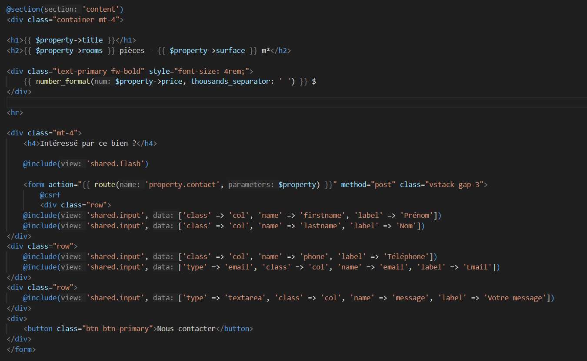
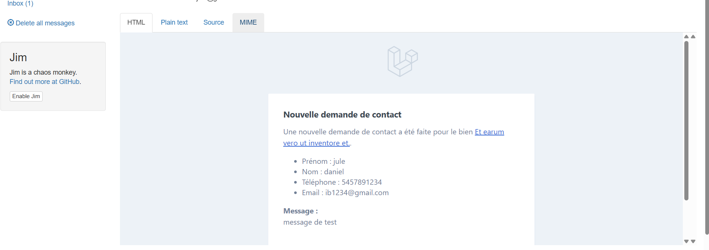
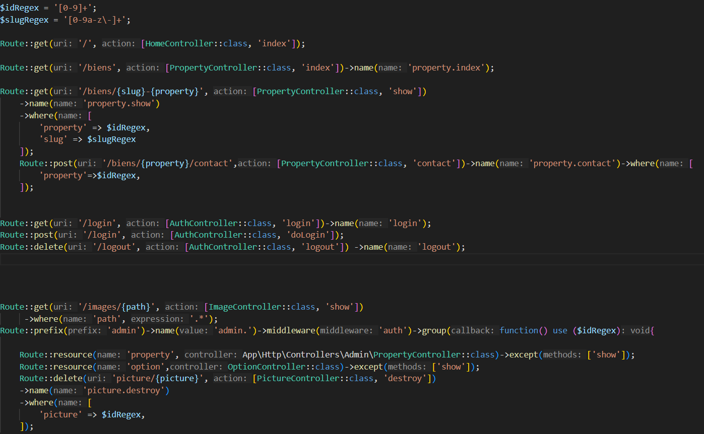
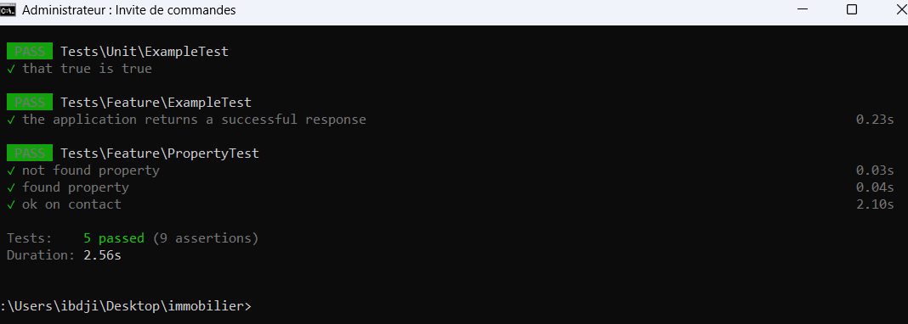

#  Laravel Real Estate Application — Web Developer Portfolio (Laravel)

Welcome to my full Laravel project, developed as a concrete demonstration of my back-end and front-end skills using the Laravel framework.  
It was designed to **showcase my mastery of Laravel in a professional context**, especially in view of career opportunities.

---

##  Main Features

- Dynamic management and display of properties
- Automatic data generation with **Seeder** and **Factory**
- Contact form with validation and email sending
- Access control via **Policy**
- Form validation using **Form Request classes**
- Eloquent relationships (`hasMany`, `belongsTo`, etc.)
- Search, sorting, and **pagination** of property listings
- Internationalization support
- Queues management
- Modular architecture with **Service Providers**
- REST API with JSON response (`routes/api.php`)
- Laravel events management
- Automated testing with **PHPUnit**
- Modern frontend with **Vite** (JS/CSS)
- Local email testing with **Mailhog**

---

##  Technical Stack

- Laravel 10  
- PHP 8.2  
- MySQL  
- Blade + Vite  
- PHPUnit  
- Seeder, Factory, Policy, Event, Service Provider  
- Mailhog (Local SMTP for email testing)

---

##  Code Structure

| Path | Description |
|------|-------------|
| `app/Models/Property.php` | Eloquent model |
| `app/Http/Controllers/PropertyController.php` | Business logic |
| `app/Policies/PropertyPolicy.php` | Authorization rules |
| `app/Providers/` | Custom configuration |
| `routes/web.php` / `routes/api.php` | Web and API routes |
| `resources/views/` | Blade views |
| `tests/Feature/PropertyTest.php` | Feature tests |

---

## 📬 Mailhog Configuration

To test emails without a real SMTP server, the project uses **Mailhog**.

### Run Mailhog with Docker:

```bash
docker run -d -p 1025:1025 -p 8025:8025 mailhog/mailhog


MAIL_MAILER=smtp
MAIL_HOST=127.0.0.1
MAIL_PORT=1025
MAIL_USERNAME=null
MAIL_PASSWORD=null
MAIL_ENCRYPTION=null
MAIL_FROM_ADDRESS=hello@example.com
MAIL_FROM_NAME="Immobilier App"

Here are the most common and recommended screenshots to include in a Laravel portfolio project:

###  Formulaire de contact



###  Mail send



###  Definition of routes



###  Result of tests



